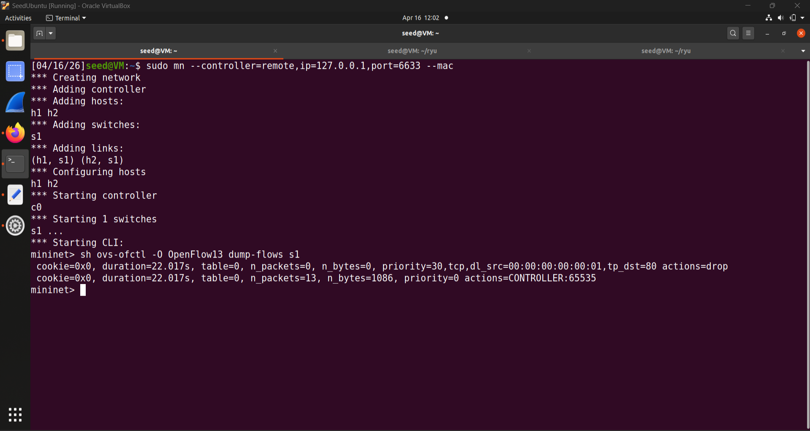
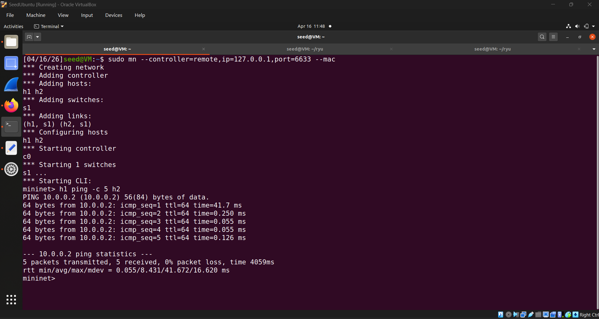
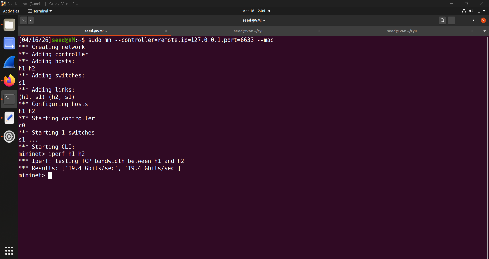
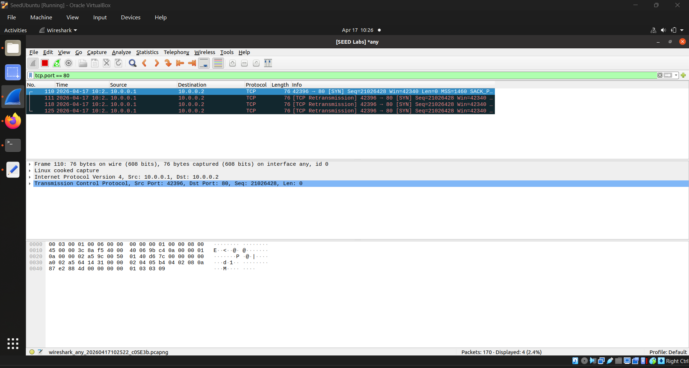
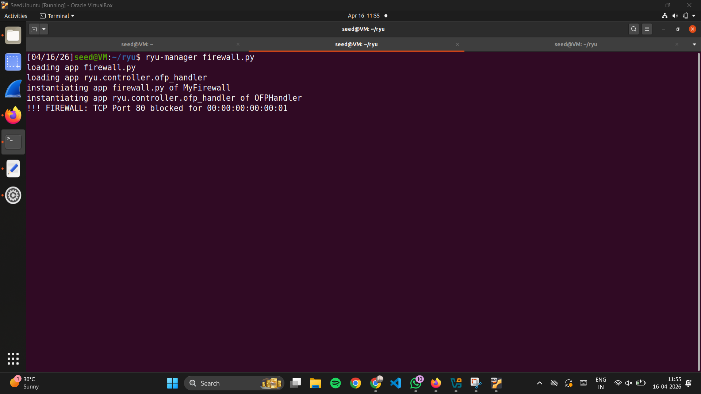
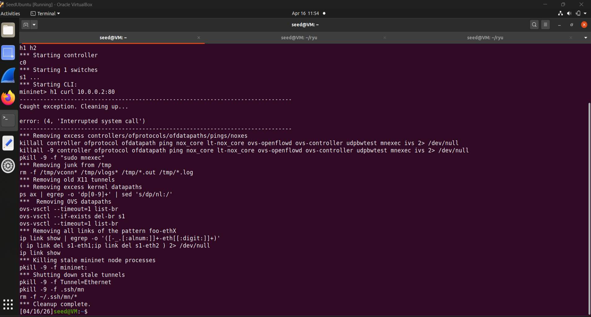

This is a professionally structured README for your GitHub repository. It includes all the required sections—Student Information, Project Overview, Setup, and Proof of Execution—while keeping it concise and "clean" for a submission.

---

# SDN-Firewall Project

## Student Information
* **Name:** Alisha Kulshrestha
* **SRN:** PES1UG24CS049

---

## Project Overview
This project implements a **Granular Layer-4 SDN Firewall** using the **Ryu controller** and **Mininet**. It demonstrates the core SDN principle of decoupling the control and data planes to enforce security policies at the network edge.

### Key Functionalities:
* **Centralized Management:** Security logic resides entirely within the Ryu controller.
* **Dynamic Policy Enforcement:** Pushing OpenFlow 1.3 rules to switch hardware.
* **Protocol Filtering:** Selective blocking of **TCP Port 80 (HTTP)** while permitting ICMP (Ping).
* **Identity Awareness:** Filtering based on unique Host MAC addresses.

---

## Setup and Execution Steps

### 1. Prerequisites
Ensure Ryu and Mininet are installed on your Ubuntu VM.

### 2. Start the Controller
In a dedicated terminal, launch the firewall application:
```bash
ryu-manager firewall.py
```

### 3. Start the Network Topology
In a second terminal, launch the Mininet environment:
```bash
sudo mn --controller=remote,ip=127.0.0.1,port=6633 --mac
```

### 4. Verify Flow Tables
Check the hardware-level rules pushed by the controller:
```bash
mininet> sh ovs-ofctl -O OpenFlow13 dump-flows s1
```

### 5. Cleanup
Always clear the Mininet state after execution:
```bash
sudo mn -c
```

---

## Expected Output & Proof of Execution

### Flow Tables:


Output confirms the installation of high-priority flow rules (Priority 30) for TCP Port 80, ensuring unauthorized traffic is dropped at the switch level.

### Ping Results: 


h1 ping h2 shows a 0% packet loss, confirming that general network connectivity is maintained for allowed protocols.


333 Performance Metrics: 


The iperf results show high-speed throughput (19.4 Gbits/sec), proving the firewall logic does not bottleneck the network performance.


### Wireshark Analysis: 


Packet capture shows TCP SYN retransmissions from Host 1. This confirms the switch is dropping the packets silently without sending a reset, successfully blocking the HTTP handshake.


### Controller Status: 


The Ryu controller terminal shows the active monitoring and instantiation of the firewall application.


### Functional Correctness: 


The Mininet console shows the h1 curl command hanging, demonstrating successful blocking of HTTP traffic for the unauthorized host.


---

## References and Citations
1.  **Ryu SDN Framework:** Official Documentation for `SimpleSwitch13`.
2.  **OpenFlow Specification:** Version 1.3.0 protocol primitives.
3.  **Mininet Walkthrough:** Documentation for custom topologies and remote controllers.

---

## Conclusion
This project successfully demonstrates a functional SDN Firewall. By utilizing Python and the OpenFlow protocol, we achieved granular control over network traffic, proving that software-defined logic can effectively replace rigid, traditional hardware security configurations.
